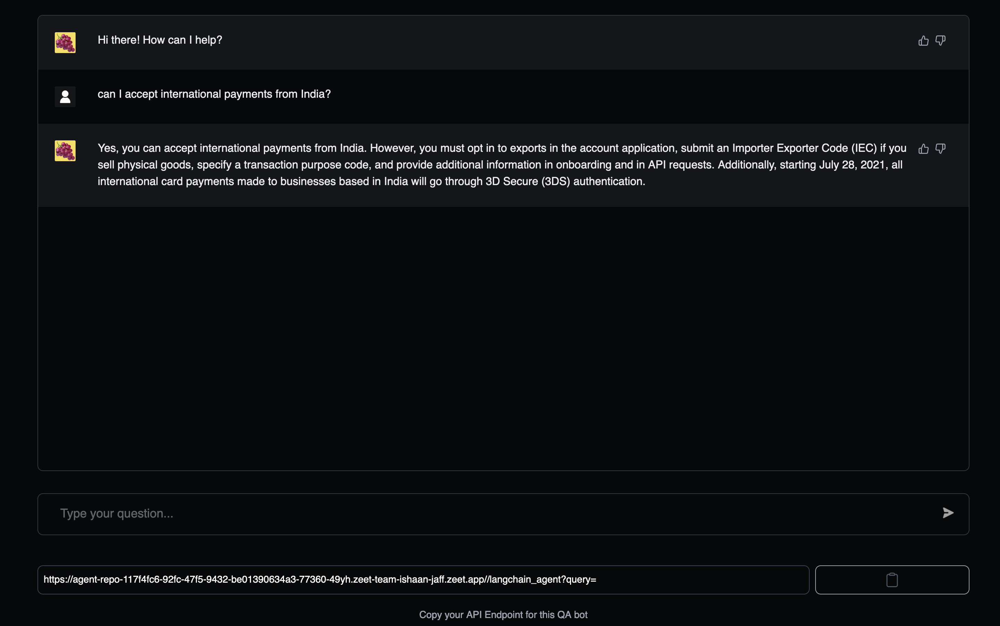
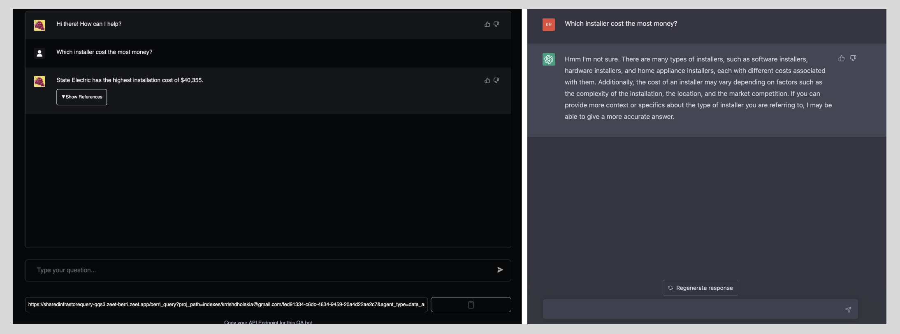

What does a Berri API call give you? 
1. **API Endpoint**: We return a deployed chatGPT app based on the data you send + based on the parameters you pass in. You can embed this into any application / surface you like (e.g. using your Berri app to answer customer questions in Zendesk).
2. **Web App**: We also return a web app you can use to quickly prototype and share your deployed app. 

<Frame caption="A Berri App built on top of Stripe's documentation">
  
</Frame>

<ResponseExample>

```json Response from Berri API
{
    "api_endpoint": "chat.berri.ai/aHR0cHM6Ly9zaGFyZWRpbmZyYXN0b3JlcXVlcnktcXFzMy56ZWV0LWJlcnJpLnplZXQuYXBwL2JlcnJpX3F1ZXJ5P3Byb2pfcGF0aD1pbmRleGVzL2tycmlzaGRob2xha2lhQGdtYWlsLmNvbS82NjJmMDZmMi04MGQ0LTQxMzQtYmYxMi0xMWZiM2JhMWEyODM=&query=<user_query>",
    "website_endpoint": "chat.berri.ai/aHR0cHM6Ly9zaGFyZWRpbmZyYXN0b3JlcXVlcnktcXFzMy56ZWV0LWJlcnJpLnplZXQuYXBwL2JlcnJpX3F1ZXJ5P3Byb2pfcGF0aD1pbmRleGVzL2tycmlzaGRob2xha2lhQGdtYWlsLmNvbS82NjJmMDZmMi04MGQ0LTQxMzQtYmYxMi0xMWZiM2JhMWEyODM="
}
```

</ResponseExample>

Berri offers you 2 primary ways of creating a chatGPT app **on your data**.

### 1. [Website / Single File Upload](endpoint/file_upload)
Use Case: Good for extracting responses from a website (e.g. company website) or single documents (e.g. .pdf, .docx, .txt, .pptx, .csv). 


### 2. [CSV / Folder Upload](endpoint/csv_or_folder_upload)
Use Case: Good for extracting responses from multiple data types at once or asking complex questions against a dataset. More control offered. 

# Scenarios
Our API endpoints let you spin up chatGPT apps for any scenario you might envision. However, we also provide presets for common scenarios. 

Today, we offer presets for `customer support` and `spreadsheet question-answering`. Look at our endpoint documentation to cover these in more detail. 

## Tutorial 
### [Mixpanel Analysis Tutorial](tutorials/mixpanel_tutorial)

Spin up a chatGPT app for all your customer's mixpanel data in minutes. 

## Why use Berri vs. raw ChatGPT? 

Since chatGPT has a limited context window (~4k tokens), it's hard to pass large amounts of information (e.g. Database, notion docs, etc.) into it. Berri abstracts the complexity of getting chatGPT to work on your large data, with a simple API endpoint. Want to tinker / improve results? reach out @ krrish@berri.ai, and we'll help you get set-up.

<Frame caption="Side-by-side comparison of Berri vs. Raw ChatGPT on your financial data.">
  
</Frame>


**Note**: If it takes you longer than 5 minutes to spin up your app, email us a screenshot @ krrish@berri.ai and we'll buy you coffee wherever you are.