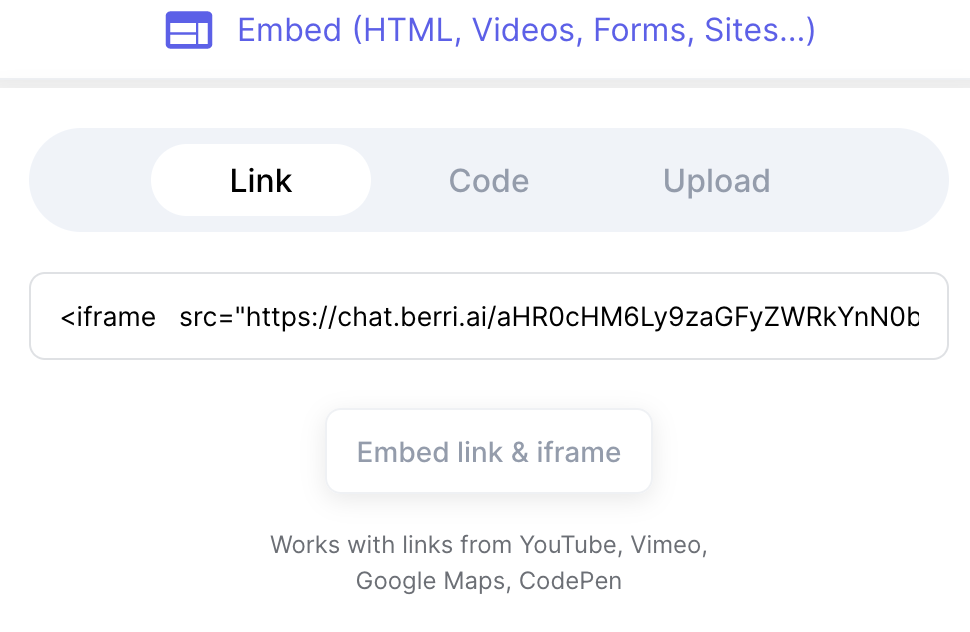

The fastest way to embed berri into your website is through an iframe. 

Here's what you need to do to get embedded: 

## Step 1: Grab your Berri App URL 

## Step 2: Replace src with your app url

This is the code you need: 
```html

<iframe
	src="<your_berri_app_url>"
	frameborder="0"
	width="850"
	height="450"
></iframe>
```

For a given berri app url `https://chat.berri.ai/aHR0cHM6Ly9zaGFyZWRkYnN0b3JlcXVlcnktN2JlYS04aGp3LnplZXQtYmVycmkuemVldC5hcHAvYmVycmlfcXVlcnk_cHJval9wYXRoPWluZGV4ZXMva3JyaXNoZGhvbGFraWFAZ21haWwuY29tL2Q0N2I2NTUxLWEyYjQtNDBjZC1hMzlkLTI3ZTMyMzQyNDgzMSZhZ2VudF90eXBlPWNvbXBsZXhfc3VwcG9ydA==`

This is what it would look like: 
```html
<iframe
	src="https://chat.berri.ai/aHR0cHM6Ly9zaGFyZWRkYnN0b3JlcXVlcnktN2JlYS04aGp3LnplZXQtYmVycmkuemVldC5hcHAvYmVycmlfcXVlcnk_cHJval9wYXRoPWluZGV4ZXMva3JyaXNoZGhvbGFraWFAZ21haWwuY29tL2Q0N2I2NTUxLWEyYjQtNDBjZC1hMzlkLTI3ZTMyMzQyNDgzMSZhZ2VudF90eXBlPWNvbXBsZXhfc3VwcG9ydA=="
	frameborder="0"
	width="850"
	height="450"
></iframe>
```

## Step 3: Embed into your website 

Just paste your code into your website. For example, if you're trying to embed this into a no-code website like Typedream, this is what it would look like: 

